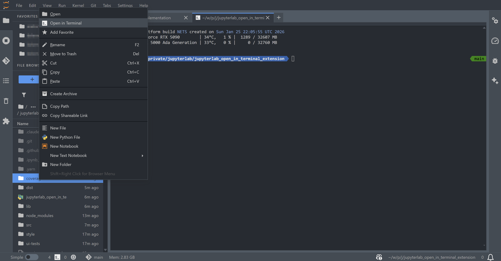

# jupyterlab_open_in_terminal_extension

[](https://github.com/stellarshenson/jupyterlab_open_in_terminal_extension/actions/workflows/build.yml)
[](https://www.npmjs.com/package/jupyterlab_open_in_terminal_extension)
[](https://pypi.org/project/jupyterlab-open-in-terminal-extension/)
[](https://pepy.tech/project/jupyterlab-open-in-terminal-extension)
[](https://jupyterlab.readthedocs.io/en/stable/)
[](https://kolomolo.com)
[](https://www.paypal.com/donate/?hosted_button_id=B4KPBJDLLXTSA)

> [!TIP]
> This extension is part of the [stellars_jupyterlab_extensions](https://github.com/stellarshenson/stellars_jupyterlab_extensions) metapackage. Install all Stellars extensions at once: `pip install stellars_jupyterlab_extensions`

Open a terminal at any location in the file browser with a single right-click. JupyterLab already provides "Open in Terminal" for folders; this extension completes the picture by adding the same command, with the same label, for files and the empty file browser area.



## Features

- **Context menu on files** - Right-click any file to open a terminal in its parent folder
- **Context menu on empty area** - Right-click empty space to open a terminal in the current folder
- **Complements the built-in command** - Reuses JupyterLab's own "Open in Terminal" label and terminal command, so folders keep the native item and no duplicate appears
- **Seamless integration** - Works with JupyterLab's native terminal

## Requirements

- JupyterLab >= 4.0.0

## Install

```bash
pip install jupyterlab-open-in-terminal-extension
```

## Uninstall

```bash
pip uninstall jupyterlab-open-in-terminal-extension
```
